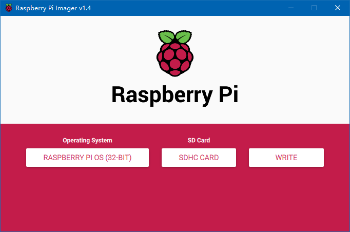
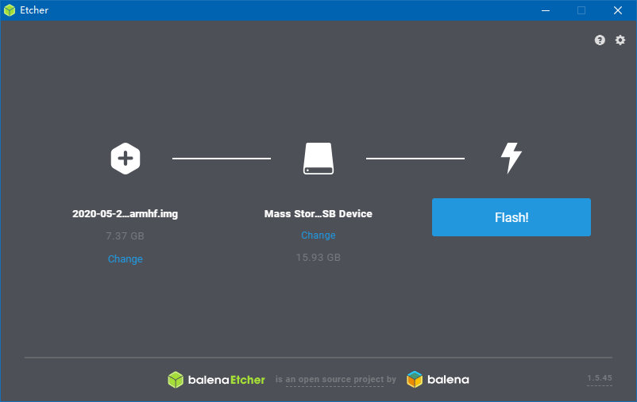
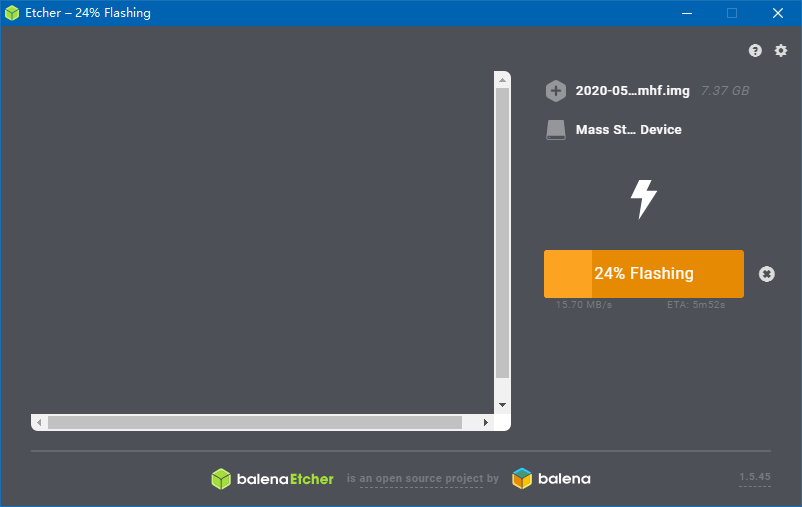

# 树莓派

## 系统写入

### 自动安装

官方给出了一个自动安装镜像的程序，



自动安装速度太慢，转用以前的手动写入系统。

### 手动安装

对于系统写入分为两步，下载镜像，将镜像写入sd卡，当然也可以加上第三步，将sd卡插入树莓派开机。

镜像下载从官网https://www.raspberrypi.org/downloads/选择对应系统即可。

之后是写入sd卡，之前用的Win32DiskImager可以去http://sourceforge.net/projects/win32diskimager/这里下，我之前用的是那个。这回尝个鲜，毕竟我从来不走回头路。这回使用的是balenaEtcher下载地址为https://www.balena.io/etcher/其界面确实做的比win32那个好，而且可以直接使用下载的zip在写入的时候解压，不必手动解压还是不错的。等待进度条读完就写完系统镜像了，将sd卡插入树莓派即可使用。







以上就是系统写入部分

## 远程控制配置

使用putty链接树莓派，而putty的链接需要获得树莓派的ip地址，两种方法，最简单的方法为使用有线链接，将其链接到路由器上或电脑上。路由器通过登录路由器管理员账号查看，电脑通过查看网络链接方式查看。另一种方法为配置树莓派链接无线网，参考这篇文章https://sspai.com/post/38780，在树莓派的系统sd卡上新建wpa_supplicant.conf文件里面写上

```
network={

ssid=”将我替换成Wi-Fi名”

psk=”将我替换成Wi-Fi密码”

priority=将我替换成数字，数字越大代表优先级越高

}
```


其可以使得树莓派自动链接电脑或手机热点之后通过查看网络设置即可获得ip地址。

最后建立ssh无后缀文件。其使得树莓派在开机时能进入ssh环境。

之后打开putty，通过ssh进入树莓派其默认用户名pi密码raspberry，注意Linux系统下密码一般无回显，即输入了无显示。

然后运行

```
sudo apt-get install xrdp
sudo apt-get install vnc4server tightvncserver
sudo /etc/init.d/xrdp restart
```

即可使用win自带的运程控制来操作树莓派，如果树莓派写入系统包含图像界面即可进行图像界面控制。

win下具体为，组合键WIN+R，输入mstsc.exe，调出win自带的远程桌面，输入树莓派的ip，即可远程连接。